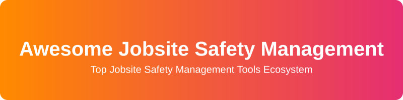

  

<strong>A comprehensive curated list of the best Jobsite Safety Management Software, SaaS products, and Open-Source tools for Construction and Industrial EHS (Environment, Health, and Safety) operations in 2026. Discover digital inspections, hazard reporting, incident management, and more.</strong>

# Awesome-Jobsite-Safety-Management

# Top Jobsite Safety Management Tools Ecosystem

**Curated List of SaaS Products & Open-Source GitHub Projects**  
*Focused on Construction & Industrial Jobsite Safety, Inspections, Incidents, Compliance & EHS Operations*  
**Last updated: August 2026**

This repository tracks notable **SaaS platforms** and **open-source projects** for **Jobsite Safety Management**. These tools support digital inspections, hazard reporting, incident management, toolbox talks, permits, training/certification tracking, corrective actions, and overall EHS (Environment, Health & Safety) compliance on construction and industrial sites.

**Examples** include Safesite, HammerTech, SiteDocs, SafetyCulture (iAuditor), KPA, EHS Insight, EcoOnline, Intelex, Cority, and SafetyAmp (the category leaders).

**Open-source emphasis**: This section is heavily expanded with every major active project for self-hosting, custom form engines, AI-powered PPE detection, hazard management, HSE calculators, and open safety data processing — ideal for contractors, safety managers, researchers, and developers building transparent, offline-capable, or privacy-first jobsite safety solutions.

Contributions welcome! Open a PR to add/update entries. Keep descriptions factual and link to official sites.

## 📋 Table of Contents
- [SaaS/Hosted Platforms](#saas-products)
- [Open-Source GitHub Projects](#open-source-github-projects)
- [How to Contribute](#how-to-contribute)
- [Disclaimer](#disclaimer)

## 🚀 SaaS/Hosted Platforms

| Platform | Description | Pricing / Free Tier | Company Size (Est. Valuation/Revenue) |
|----------|-------------|---------------------|---------------------------------------|
| **[SafetyCulture (formerly iAuditor)](https://safetyculture.com/)** | Mobile-first operations and inspection platform with extensive template libraries, issue tracking, corrective actions, training, and analytics used widely for field safety checks. | Premium plans start at ~$24/user/mo. Free tier available (up to 10 users, 5 active inspection templates). | ~$1.8B Valuation |
| **[EcoOnline](https://www.ecoonline.com/)** | Multi-site EHS platform covering incidents, risk assessments, chemical/SDS management, contractor compliance, inspections, and environmental reporting. | Custom pricing. No free tier. | ~$1B Valuation |
| **[Cority](https://www.cority.com/)** | Comprehensive EHS+ platform (CorityOne) unifying occupational health, safety, environmental compliance, incident management, and sustainability reporting for large organizations. | Custom pricing. No free tier. | ~$1B Valuation |
| **[Intelex](https://www.intelex.com/)** | Highly configurable enterprise EHSQ platform for incident management, audits, CAPA, risk assessment, compliance tracking, and complex multi-site workflows. | Custom pricing. No free tier. | $850M (Acquired) |
| **[KPA](https://kpa.io/)** | Configurable EHS software (KPA Flex) combining safety management, training, incident tracking, and compliance tools tailored for industrial and construction workforces. | Custom pricing. No free tier. | Mid-market Enterprise |
| **[HammerTech](https://www.hammertech.com/)** | Construction-focused safety and site operations platform covering worker orientations, subcontractor compliance, permits, inspections, incidents, and project-wide safety workflows. | Custom pricing. No free tier. | ~$100M+ Valuation |
| **[Safesite](https://safesitehq.com/)** | Mobile-first safety management platform for inspections, hazard reporting, incidents, toolbox talks, and leading-indicator analytics. Popular with small-to-midsize contractors and subcontractors. | Premium plans start at ~$16/user/mo. Free tier available (reporting limited to last 30 days). | ~$50M Valuation |
| **[SiteDocs](https://www.sitedocs.com/)** | Digital forms and compliance platform for hazard assessments, FLRAs/JSAs, toolbox talks, certifications, corrective actions, and real-time safety monitoring on jobsites. | Custom pricing. No free tier. | Mid-market |
| **[EHS Insight](https://www.ehsinsight.com/)** | Cloud EHS platform focused on incident management, inspections, safety observations, corrective actions, and mobile-friendly workflows for mid-market teams. | Custom pricing. No free tier. | Mid-market |
| **[SafetyAmp](https://www.safetyamp.com/)** | Modern safety management software emphasizing employee engagement, incident reporting, observations, and streamlined EHS workflows for growing teams. | Custom pricing. No free tier. | Startup / Growing |

## 💻 Open-Source GitHub Projects

| Repo | Description | Stars |
|------|-------------|-------|
| **[braedonsaunders/beaconhs](https://github.com/braedonsaunders/beaconhs)** | Multi-tenant open-source HSE platform built for industrial construction. |  |
| **[open-ehs/open-ehs](https://github.com/open-ehs/open-ehs)** | Open-source EHS management platform for tracking incidents and corrective actions. |  |
| **[SafetyMP/Autonomous-EHS-Management](https://github.com/SafetyMP/Autonomous-EHS-Management)** | Self-hostable open-source EHS web console for incidents, CAPA, metrics, documents. |  |
| **[Osha-AI/Osha-AI](https://github.com/Osha-AI/Osha-AI)** | AI models and datasets for OSHA safety compliance checking. |  |
| **[safetibase/safetibase](https://github.com/safetibase/safetibase)** | System for identification, management, and communication of health & safety hazards. |  |
| **[SmartQHSE/hse-calculators](https://github.com/SmartQHSE/hse-calculators)** | Pure-TypeScript library of 30+ open-source HSE calculators. |  |
| **[docufinch/docufinch-ehs](https://github.com/docufinch/docufinch-ehs)** | Open-source EHS platform with compliance features, incident management, audits. |  |
| **[UmairPashaa/HSE-Digital-Toolkit](https://github.com/UmairPashaa/HSE-Digital-Toolkit)** | Offline-capable PWA with open-source HSE templates and digital forms. |  |
| **[C-Nekopedia/SiteGuard](https://github.com/C-Nekopedia/SiteGuard)** | Construction site safety monitoring system using computer vision (YOLO) for PPE. |  |
| **[munhim2005/safesight-ppe-monitor](https://github.com/munhim2005/safesight-ppe-monitor)** | Local-first real-time PPE monitoring system combining YOLOv8, CLIP. |  |
| **[808cadger/construction-safety-ai](https://github.com/808cadger/construction-safety-ai)** | Production-ready open-source system for AI-powered PPE detection. |  |
| **[ratelworks/agent-safety-oss](https://github.com/ratelworks/agent-safety-oss)** | Open-source tools that help generate and review statutory safety documents. |  |
| **[jim-kinter/csat-construction-safety-analytics-tool](https://github.com/jim-kinter/csat-construction-safety-analytics-tool)** | Full-stack platform turning OSHA incident data into insights. |  |
| **[egorfolley/Vision-AI-Agent-for-Construction-Safety](https://github.com/egorfolley/Vision-AI-Agent-for-Construction-Safety)** | Vision AI agent with RAG analyzing jobsite visual data against OSHA. |  |

### 🔧 Additional Strong Open-Source Options

- **PPE Detection & Computer Vision projects** (multiple YOLOv8/YOLO-based repos for hard-hat, vest, and gear compliance on jobsites).
- **HSE form & template libraries** and Progressive Web Apps for offline risk assessments, JSAs, and toolbox talks.
- **OpenConstructionERP** (includes HSE modules) and related construction open-source ERP components with safety tracking.
- **Incident Commander** and other self-hosted incident management tools adaptable to jobsite use cases.
- Community **AI + computer vision** pipelines for real-time hazard detection and safety analytics notebooks.
- **Awesome-HSE** curated lists and related open resource repositories for regulations, datasets, and tools.

**Frameworks for building custom systems**: Combine **BeaconHS** or **DocuFinch** form engines with **InfluxDB + Grafana** dashboards, **Node-RED** for sensor flows, open PPE detection models, **HSE Calculators**, and local LLMs (e.g., Ollama) for intelligent, self-hosted jobsite safety platforms.

## 🤝 How to Contribute

1. Fork the repo.
2. Add/edit entries in `README.md` (follow existing format).
3. Include: name, link, 1–2 sentence description, and whether it's SaaS or open-source.
4. Submit PR with a short explanation.

Star the repo if you find it useful!

## ⚠️ Disclaimer

- This is a **community-curated** list — not exhaustive and not an endorsement.
- Jobsite safety tools must comply with applicable regulations (OSHA, local HSE rules, ISO 45001, etc.).
- Self-hosted open-source solutions require proper security, reliability, data protection, and (where relevant) maritime- or construction-grade hardening.

---

**Made for construction companies, safety managers, EHS professionals, general contractors, and technologists.**  
Let's make jobsite safety management more open, data-driven, and effective.
